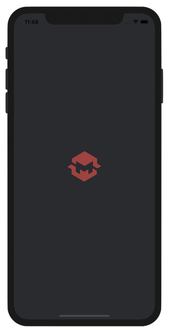
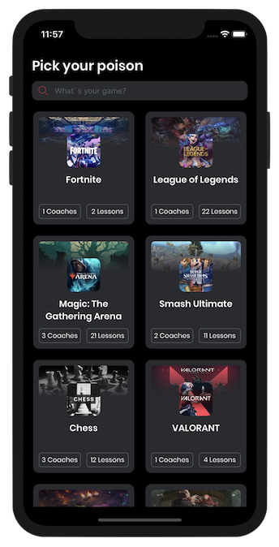
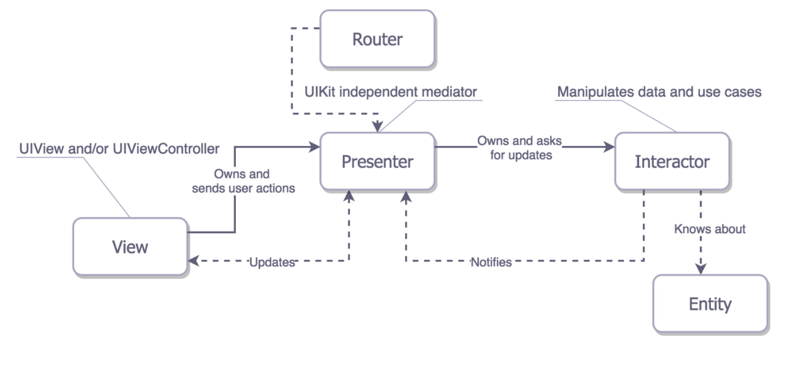
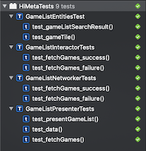

# HiMeta

Small POC of an iOS application using modularized features with VIPER design pattern

- Game list fetched from a remote API
- Search feature with throttle to prevent unnecessary network requests
- Build with modularization in mind
- Implementing VIPER architecture for better responsibility distribution between types
- Unit tested on non UI related classes

To-do list
---
- [ ] Implement navigation to new modules (game detail)
- [ ] Implement infinite scrolling with paging (until endpoint returns no more results)
- [ ] Add placeholder for remote images when loading
- [ ] Display loading status when fetching data
