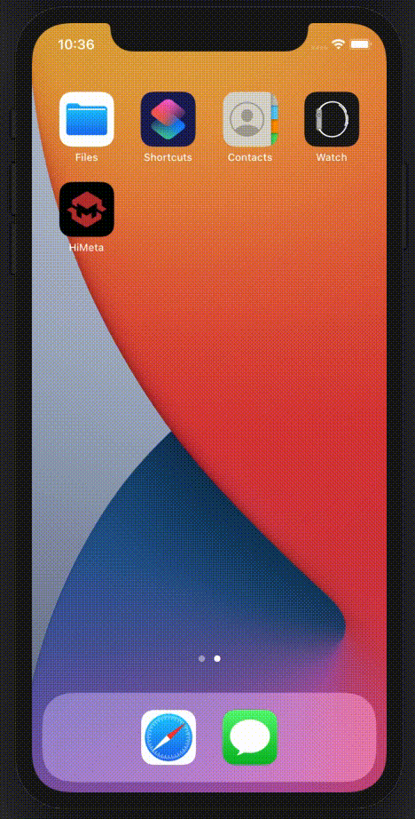
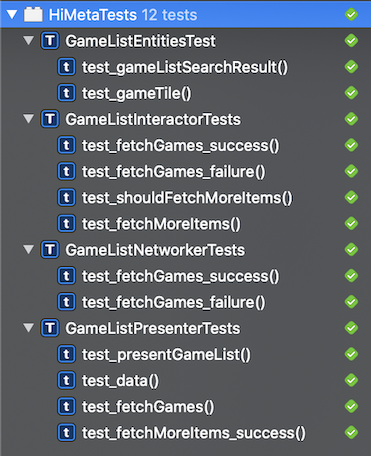

# HiMeta

Small POC of an iOS application using modularized features with VIPER design pattern

- Game list fetched from a remote API
- Search feature with throttle to prevent unnecessary network requests
- Game list fetched in pages (pageSize is currently 20)
- Infinite scroll as long as API keeps returning values
- Build with modularization in mind
- Implementing VIPER architecture for better responsibility distribution between types
- Unit tested on all non UIKit dependent components (all tests passing and coverage over 80%)

To-do list
---
- [ ] Implement navigation to new modules (game detail)
- [ ] Add placeholder for remote images when loading
